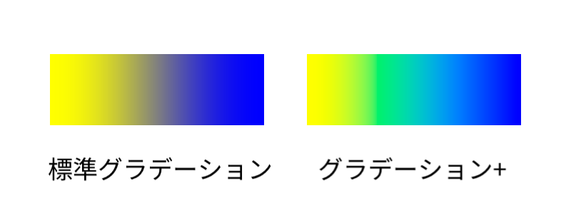
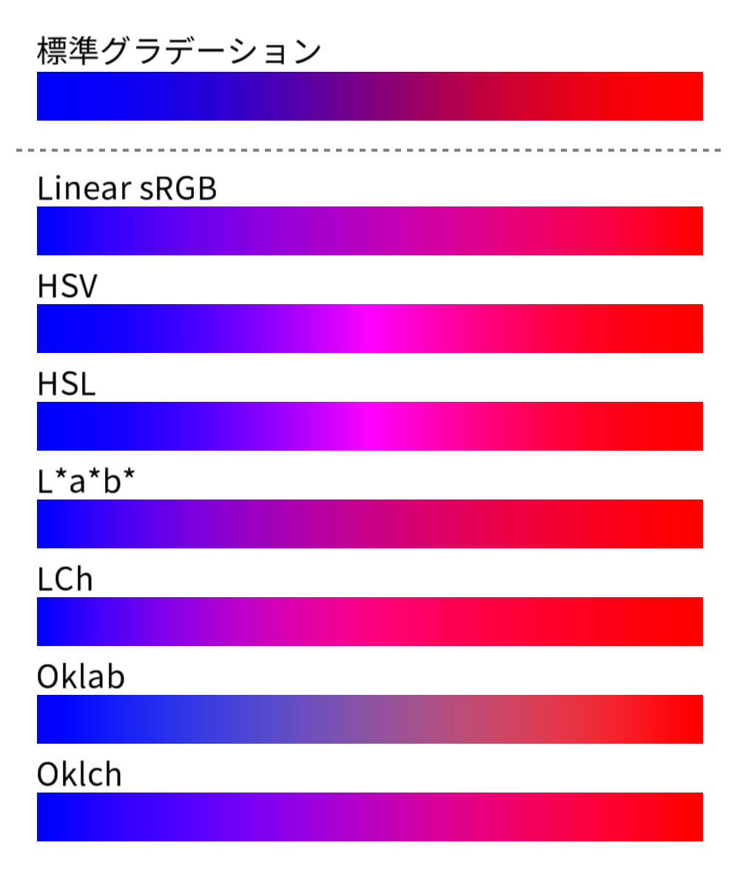
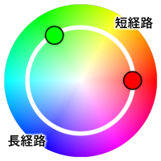

# AviUtl2 グラデーション+
sRGB 以外の色空間 (Linear sRGB, HSV, HSL, L\*a\*b\*, LCh, Oklab, Oklch) でグラデーションさせる [AviUtl2](https://spring-fragrance.mints.ne.jp/aviutl/) 用スクリプトです。

## 導入方法
1. [Release](https://github.com/azurite581/AviUtl2-GradientPlus/releases) から zip ファイルをダウンロードしてください。
2. zip ファイルを展開し、`グラデーション+.anm2` を `C:\ProgramData\aviutl2\Script` フォルダ、または一層下にあるフォルダに入れてください。

## 使い方
グラデーションをかけたいオブジェクトに `グラデーション+` を適用してください。デフォルトでは `色調整` カテゴリの中にあります。

## パラメーター

### トラックバー
- #### 中心 X
  中心点から X 方向へのオフセット値。

- #### 中心 Y
  中心点から Y 方向へのオフセット値。

- #### 角度
  グラデーションの角度。

- #### 幅
  グラデーションの幅。

### 設定ダイアログ
- #### 強さ
  グラデーションの適用度。

- #### 合成モード
  合成モードを指定します。項目は標準グラデーションと同じです。

- #### 形状
  グラデーションの形状を指定します。標準グラデーションの形状のほか、`角丸短形`、`円形ループ`、`短形ループ`、`凸形ループ`、`角丸短形ループ` が選択できます。

- #### 色空間
    グラデーションの色空間を指定します。
  名称 | 簡単な説明 |
  :---|:---|
  | Linear&nbsp;sRGB |ガンマを除去した sRGB。|
  | HSV |Hue(色相)、Saturation(彩度)、Value(明度)からなる色空間。|
  | HSL|Hue(色相)、Saturation(彩度)、Lightness(輝度)からなる色空間。黒や白とのグラデーションで HSV との違いが顕著に表れる。|
  | L\*a\*b\* (CIE LAB) |人間の視覚に基づいて色の差が均等に認識できるように設計された色空間。本スクリプトでは D65 を白色点とする。|
  | LCh | L\*a\*b* の a, b を極座標に変換したもの。 Hue(色相)を回転させながら補間できるため、色の変化がより自然になる。
  | Oklab |L\*a\*b* の知覚的均等性を改善した色空間。
  | Oklch |Oklab を極座標に変換したもの。

  **比較画像**
  

- #### 補間経路
  HSV、HSL、LCh、Oklch といった色相を持つ色空間が、色相環上でどのような経路で補間するか指定します。
  | 値 | 経路 |
  |:---:|:---:|
  | `1` | 短経路 |
  | `2` | 長経路 |

  

- #### 開始色
  開始色を指定します。初期値は `0xffffff` です。

- #### 終了色
  終了色を指定します。初期値は `0x000000` です。

## ライセンス
[CC0](LICENSE.txt) に基づくものとします。

## 更新履歴
- #### v1.0.0 (2025/7/13)
  初版
