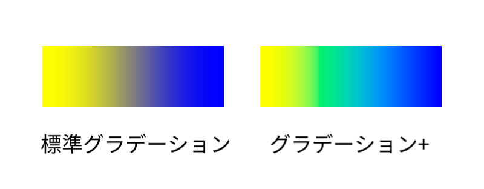
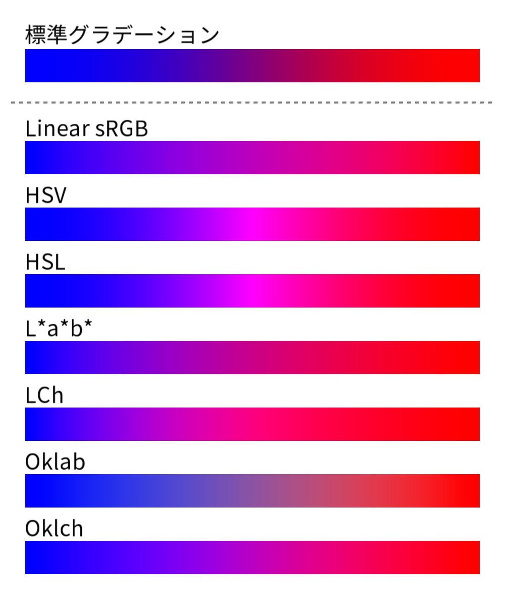
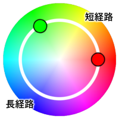

# AviUtl2 グラデーション+

sRGB 以外の色空間 (Linear sRGB, HSV, HSL, L\*a\*b\*, LCh, Oklab, Oklch) でグラデーション加工をする [AviUtl2](https://spring-fragrance.mints.ne.jp/aviutl/) 用スクリプトです。



## 動作環境

- [AviUtl ExEdit2](https://spring-fragrance.mints.ne.jp/aviutl/)  
`2.1.11a` で動作確認済み。

## 導入方法

次のいずれかの方法でインストールできます。

### AviUtl2 カタログを使う（推奨）
本スクリプトは [aviutl2-catalog](https://github.com/Neosku/aviutl2-catalog) に登録済みです。 メインメニュー ＞ パッケージ一覧 ＞ スクリプト ＞ グラデーション+ からインストールしてください。

### 手動インストール
[Releases](https://github.com/azurite581/AviUtl2-GradientPlus/releases/latest) から `GradientPlus_v{version}.au2pkg.zip` をダウンロードし、AviUtl2 のプレビューにドラッグ&ドロップしてください。

> [!Note]
> ### For non-Japanese speaking users
> Please download the translation files from [here](https://github.com/azurite581/aviutl2_translations_azurite/releases/latest).

## 使い方

グラデーションをかけたいオブジェクトに `グラデーション+` を適用してください。デフォルトでは `色調整` カテゴリの中にあります。

## パラメーター

### トラックバー

- #### 中心 X

  中心点から X 方向へのオフセット値。

- #### 中心 Y

  中心点から Y 方向へのオフセット値。

- #### 角度

  グラデーションの角度。

- #### 幅

  グラデーションの幅。

### 設定ダイアログ

- #### 強さ

  グラデーションの適用度。

- #### 合成モード

  合成モードを指定します。項目は標準グラデーションと同じです。

- #### 形状

  グラデーションの形状を指定します。標準グラデーションの形状のほか、`角丸矩形`、`円形ループ`、`矩形ループ`、`凸形ループ`、`角丸矩形ループ` が選択できます。

- #### 色空間

    グラデーションの色空間を指定します。
  | 名称 | 簡単な説明 |
  | :--- | :--- |
  | `sRGB` | 標準グラデーションと同じ。 |
  | `Linear sRGB` | ガンマを除去した sRGB。 |
  | `HSV` | Hue(色相)、Saturation(彩度)、Value(明度)からなる色空間。 |
  | `HSL` | Hue(色相)、Saturation(彩度)、Lightness(輝度)からなる色空間。黒や白とのグラデーションで HSV との違いが顕著に表れる。 |
  | `L*a*b*`<br>(CIE LAB) | 人間の視覚に基づいて色の差が均等に認識できるように設計された色空間。本スクリプトでは D50 を白色点とする。 |
  | `LCh` | L\*a\*b* の a, b を極座標に変換したもの。 Hue(色相)を回転させながら補間できるため、色の変化がより自然になる。 |
  | `Oklab` | L\*a\*b* の知覚的均等性を改善した色空間。 |
  | `Oklch` | Oklab を極座標に変換したもの。 |

  **比較画像**
  

- #### 補間経路

  HSV、HSL、LCh、Oklch といった色相を角度として表す色空間が、色相環上でどのような経路で補間するか指定します。
  | 値 | 経路 |
  | :---: | :---: |
  | `1` | 短経路 |
  | `2` | 長経路 |

  

- #### 開始色

  開始色を指定します。初期値は `0xffffff` です。

- #### 終了色

  終了色を指定します。初期値は `0x000000` です。

- #### 開始色透明度

  開始色の透明度を指定します。

- #### 終了色透明度

  終了色の透明度を指定します。

## ビルド

### 環境
- Windows11
- Git
- [mise](https://mise.jdx.dev/)

### 手順

1. 本リポジトリを任意の場所にクローンします。
    ```bash
    git clone https://github.com/azurite581/AviUtl2-GradientPlus.git
    ```

2. クローンしたフォルダに移動し、ビルドに必要なツール（[aulua](https://github.com/karoterra/aviutl2-aulua)、[aviutl2-cli](https://github.com/sevenc-nanashi/aviutl2-cli)）を mise でインストールします。
    ```bash
    cd AviUtl2-GradientPlus
    mise i
    ```

3. aviutl2-cli を使ってビルドします。
    ```bash
    au2 prepare
    au2 dev  # または au2 preview
    ```

## 使用したツール

### [aulua](https://github.com/karoterra/aviutl2-aulua)

<details>
<summary>MIT License</summary>

```text
MIT License

Copyright (c) 2025 karoterra

Permission is hereby granted, free of charge, to any person obtaining a copy
of this software and associated documentation files (the "Software"), to deal
in the Software without restriction, including without limitation the rights
to use, copy, modify, merge, publish, distribute, sublicense, and/or sell
copies of the Software, and to permit persons to whom the Software is
furnished to do so, subject to the following conditions:

The above copyright notice and this permission notice shall be included in all
copies or substantial portions of the Software.

THE SOFTWARE IS PROVIDED "AS IS", WITHOUT WARRANTY OF ANY KIND, EXPRESS OR
IMPLIED, INCLUDING BUT NOT LIMITED TO THE WARRANTIES OF MERCHANTABILITY,
FITNESS FOR A PARTICULAR PURPOSE AND NONINFRINGEMENT. IN NO EVENT SHALL THE
AUTHORS OR COPYRIGHT HOLDERS BE LIABLE FOR ANY CLAIM, DAMAGES OR OTHER
LIABILITY, WHETHER IN AN ACTION OF CONTRACT, TORT OR OTHERWISE, ARISING FROM,
OUT OF OR IN CONNECTION WITH THE SOFTWARE OR THE USE OR OTHER DEALINGS IN THE
SOFTWARE.
```

</details>

### [aviutl2-cli](https://github.com/sevenc-nanashi/aviutl2-cli)

<details>
<summary>MIT License</summary>

```text
MIT License

Copyright (c) 2026 Nanashi. <sevenc7c.com>

Permission is hereby granted, free of charge, to any person obtaining a copy
of this software and associated documentation files (the "Software"), to deal
in the Software without restriction, including without limitation the rights
to use, copy, modify, merge, publish, distribute, sublicense, and/or sell
copies of the Software, and to permit persons to whom the Software is
furnished to do so, subject to the following conditions:

The above copyright notice and this permission notice shall be included in all
copies or substantial portions of the Software.

THE SOFTWARE IS PROVIDED "AS IS", WITHOUT WARRANTY OF ANY KIND, EXPRESS OR
IMPLIED, INCLUDING BUT NOT LIMITED TO THE WARRANTIES OF MERCHANTABILITY,
FITNESS FOR A PARTICULAR PURPOSE AND NONINFRINGEMENT. IN NO EVENT SHALL THE
AUTHORS OR COPYRIGHT HOLDERS BE LIABLE FOR ANY CLAIM, DAMAGES OR OTHER
LIABILITY, WHETHER IN AN ACTION OF CONTRACT, TORT OR OTHERWISE, ARISING FROM,
OUT OF OR IN CONNECTION WITH THE SOFTWARE OR THE USE OR OTHER DEALINGS IN THE
SOFTWARE.
```

</details>

## ライセンス

[CC0](LICENSE.txt) に基づくものとします。

## 更新履歴

[CHANGELOG](CHANGELOG.md) を参照してください。
